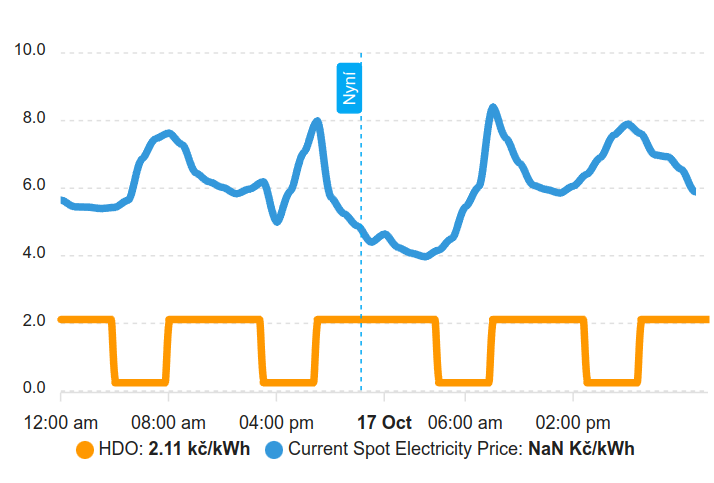

# EGD Distribuce - Home Assistant Sensor

[](https://github.com/custom-components/hacs)

This sensor is downloading json data from EGD webpage. The integration needs the **postal code** and the **HDO code** (A,B,DP). These information can be checked on EGD web site https://www.egd.cz/casy-platnosti-nizkeho-tarifu.
The **postal code** and the **HDO code** have to be defined in configuration.yaml

This sensor shows

- current state of HDO

## Installation

### Step 1: Download files

#### Option 1: Via HACS

Make sure you have HACS installed. If you don't, run `curl -sfSL https://hacs.xyz/install | bash -` in HA.
Then choose Components under HACS. Choose the menu in the upper right, and select Custom repositories. Then add this repo's URL. You should be able to choose to Install now.

#### Option 2: Manual

Clone this repository or download the source code as a zip file and add/merge the `custom_components/` folder with its contents in your configuration directory.

### Step 2: Configure

Add the following to your `configuration.yaml` file:

```yaml
# HDO example for D57d tarif - you can create multiple binary sensors (A3B7P1 A3B7P2 A3B7P6)
# Split `A3B7P01` into  A3 -> 3, B7 -> 7, P01 -> 01
binary_sensor:
  - platform: egddistribuce
    name: egdTAR
    psc: 60200
    code_a: "3"
    code_b: "7"
    code_dp: "01"
    price_vt: "2.11469"
    price_nt: "0.24611"

  - platform: egddistribuce
    name: egdPV
    psc: 60200
    code_a: "3"
    code_b: "7"
    code_dp: "02"

  - platform: egddistribuce
    name: egdTUV
    psc: 60200
    code_a: "3"
    code_b: "7"
    code_dp: "06"

# HDO example for smart meter with code `d57`
binary_sensor:
  - platform: egddistribuce
    name: egdTAR
    psc: "smart"
    code_a: "d57"
```

Codes are sometimes printed on you energy meter, or you can find them on your egd.cz

You can show them in a graph, with other entities, for example spot prices from Czech Energy Spot Prices (https://github.com/rnovacek/homeassistant_cz_energy_spot_prices):



```yaml
type: custom:apexcharts-card
graph_span: 2d
span:
  start: day
stacked: true
apex_config:
  legend:
    show: false
all_series_config:
  type: column
  group_by:
    func: avg
    duration: 1hour
now:
  show: true
  label: Nyní
header:
  show: true
  show_states: true
series:
  - entity: binary_sensor.hdo
    float_precision: 2
    data_generator: >
      return  Object.entries(entity.attributes.HDO_HOURLY).map(([date, value],
      index) => {
        return [new Date(date).getTime(), value];
      });
  - entity: sensor.current_spot_electricity_price
    float_precision: 2
    show:
      in_header: before_now
    data_generator: |
      return Object.entries(entity.attributes).map(([date, value], index) => {
        return [new Date(date).getTime(), (value + 0.35 + 0.028 + 0.114 )* 1.21];
      });
```

Since spot prices are (at the moment) hourly and HDO can be in 15 minute increments, for the graph to work well, both entities must have the same interval duration. Function `group_by` takes care of it. In this example it groups by 1 hour, because that works for me well. In your case, maybe `30minutes` or even `15minutes` might be equired.

### Step 3: Restart HA

For the newly added integration to be loaded, HA needs to be restarted.

## References

- PRE Distribuce - Home Assistant Sensor (https://github.com/slesinger/HomeAssistant-PREdistribuce)
- CEZ Distribuce - Home Assistant Sensor (https://github.com/zigul/HomeAssistant-CEZdistribuce)
