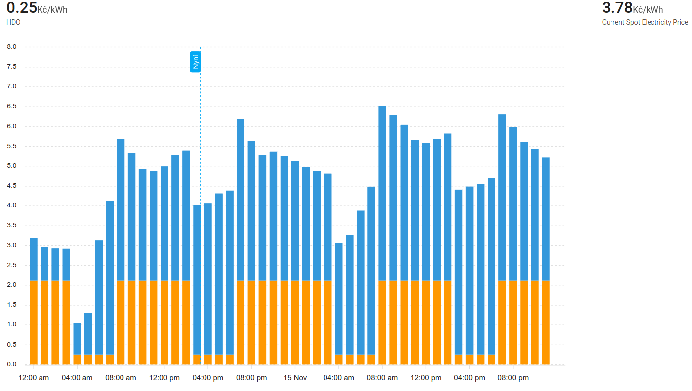

# EGD Distribuce - Home Assistant Sensor

[](https://github.com/custom-components/hacs)

Integrace pro Home Assistant sloužící ke stahování **HDO (Hromadné dálkové ovládání)** dat z API **EG.D Distribuce**.  
Umožňuje sledovat období **nízkého (NT)** a **vysokého tarifu (VT)** elektřiny v České republice.

Integrace podporuje jak **klasické elektroměry**, tak **smart měření**, a je plně konfigurovatelná přes **grafické rozhraní Home Assistantu (GUI)**.

---

## Funkce

- Konfigurace přes GUI (není potřeba YAML)
- Moderní async architektura (DataUpdateCoordinator)
- Automatická aktualizace dat
- Podpora více typů HDO měření
- Podpora klasických i smart elektroměrů
- Detailní atributy pro automatizace a grafy
- Validace zadaných PSČ a HDO kódů

---

## Podporované typy HDO


### 1. Klasické HDO (A + B + DP)
Určeno pro tradiční elektroměry využívající kombinaci kódů **A**, **B** a **DP**.


### 1. HDO Povel 
Možnost sledování více HDO příkazů současně (např. 405, 406, 410).


### 1. Smart Metr
Chytré měřiče s speciálními kódy (Cd56, C55, D56, atd.).


## 🎯 Funkce
  - Aktuální cena elektřiny

  - Zbývající čas do změny tarifu

  - Příští HDO časový slot## Installation

-  Automatické Aktualizace - Data se obnovují každých 15 minut

-  Detailní Atributy - Časy dnes/zítra, začátky, konce, region, ceny

-  Validace Dat - Automatické ověření platnosti PSČ a HDO kódů


Codes are sometimes printed on you energy meter, or you can find them on your egd.cz

You can show them in a graph, with other entities, for example spot prices from Czech Energy Spot Prices (https://github.com/rnovacek/homeassistant_cz_energy_spot_prices):



```yaml
type: custom:apexcharts-card
graph_span: 2d
span:
  start: day
stacked: true
apex_config:
  legend:
    show: false
  yaxis:
    tickAmount: 16
    max: 8
all_series_config:
  type: column
now:
  show: true
  label: Nyní
header:
  show: true
  show_states: true
series:
  - entity: binary_sensor.hdo
    float_precision: 2
    group_by:
      func: avg
      duration: 1hour
    show:
      in_header: before_now
    unit: Kč/kWh
    data_generator: >
      return  Object.entries(entity.attributes.HDO_HOURLY).map(([date, value],
      index) => {
        return [new Date(date).getTime(), value];
      });
  - entity: sensor.current_spot_electricity_price
    float_precision: 2
    show:
      in_header: before_now
    data_generator: |
      return Object.entries(entity.attributes).map(([date, value], index) => {
        return [new Date(date).getTime(), (value + 0.35 + 0.028 + 0.114 )* 1.21];
      });
```

Since spot prices are (at the moment) hourly and HDO can be in 15 minute increments, for the graph to work well, both entities must have the same interval duration. Function `group_by` takes care of it. In this example it groups by 1 hour, because that works for me well. In your case, maybe `30minutes` or even `15minutes` might be equired.


adding remaining time in GUI page
```yaml
  - entity: binary_sensor.hdo_nizky_tarif
    name: Zbývající čas
    type: attribute
    attribute: remaining_time
```

### Step 3: Restart HA

For the newly added integration to be loaded, HA needs to be restarted.

## References

- PRE Distribuce - Home Assistant Sensor (https://github.com/slesinger/HomeAssistant-PREdistribuce)
- CEZ Distribuce - Home Assistant Sensor (https://github.com/zigul/HomeAssistant-CEZdistribuce)
